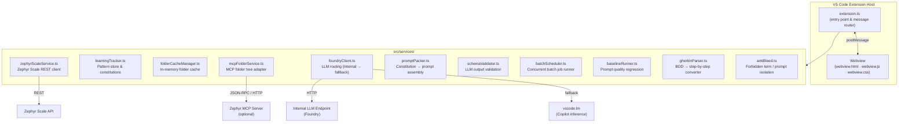
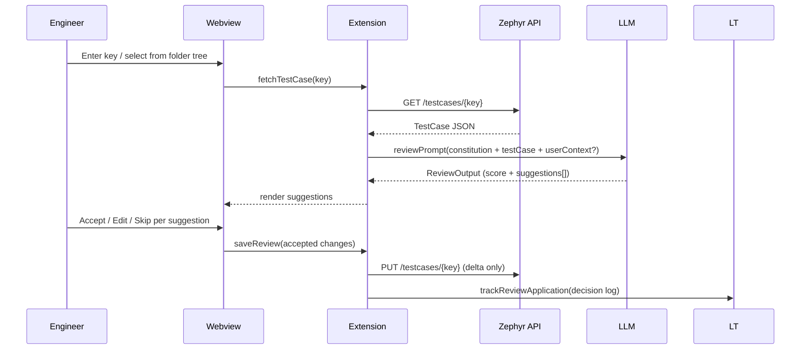
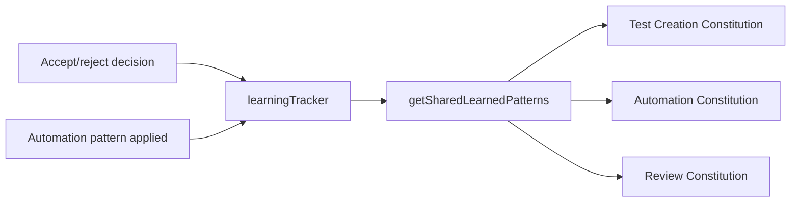
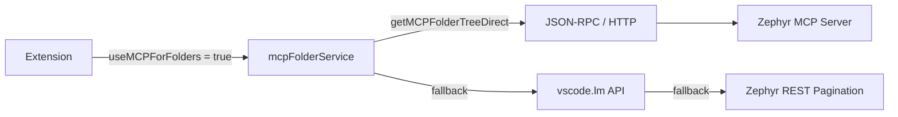

# Test Case Toolkit

> A VS Code extension that brings AI-assisted test case authoring, review, and automation generation directly into the editor — integrated with Zephyr Scale as the single source of truth.

**Current version:** 0.3.0 · **Platform:** VS Code ≥ 1.74 · **Language:** TypeScript

---

## Overview

Test Case Toolkit bridges the gap between a test management system (Zephyr Scale / Jira) and the day-to-day work of writing, improving, and automating test cases. Instead of toggling between a browser-based TMS and an editor, engineers work from a single VS Code webview that reads from and writes back to Zephyr in real time.

The extension is built around three primary workflows — **Review**, **Automate**, and **Create** — each backed by the same learning infrastructure and governed by a set of codified quality rules called Constitutions.

---

## Architecture



### Key design decisions

| Decision | Rationale |
|---|---|
| Webview + message passing | Keeps UI state in the browser context; extension host handles all I/O |
| Constitutions as runtime strings | Quality rules can be updated without recompiling; injected into prompts at call time |
| Foundry → vscode.lm fallback | Internal endpoint is faster and cheaper; Copilot inference is the zero-config fallback |
| In-memory folder cache | Zephyr folder trees can contain hundreds of folders — one fetch per session eliminates per-navigation latency |
| MCP as optional accelerator | Extension is fully functional on REST alone; MCP is an opt-in speed layer |

---

## Workflows

### 1. Review

Review loads a test case from Zephyr, sends it to the LLM with a quality-focused system prompt (the **Review Constitution**), and returns structured suggestions — one per affected field or step. The engineer accepts, edits, or skips each suggestion individually before anything is written back.



**Context input:** Before running the review, engineers can optionally describe device constraints or testing conditions (e.g. "this device has no battery — do not suggest battery steps"). This context is injected directly into the system prompt.

**Scoring:** Each review returns a quality score (0–100) broken down by category. Score bands are color-coded: ≥ 90 green, ≥ 70 yellow, < 70 red.

**BDD conversion:** If the fetched test case has `testScript.type = 'BDD'`, the Gherkin parser (`gherkinParser.ts`) converts it to step-by-step format automatically before review:
- `Given` → precondition field
- `When` → step description
- `Then` → expected result
- `And / But` → continues prior keyword context

---

### 2. Automate

Automate takes an existing manual test case and appends structured automation instructions to each step. It does not generate runnable code — it produces two annotated sections per step that a downstream automation engineer (or a separate tool) can consume:

- **AUTOMATION STEPS** — ordered procedural actions (navigate, click, call API, enter value)
- **AUTOMATION RESULT** — ordered assertions (verify, assert, confirm)

This separation is enforced at the constitution level. Mixing actions into the result section or assertions into the steps section causes schema validation to reject the output.

**WebAPI-first ordering rule (v0.3.0):** In `AUTOMATION RESULT`, `customerWebApi.*` assertions always appear before `WebServices` assertions. The rationale: the customer-facing web API is the primary verification layer; WebServices provides secondary event-level confirmation.

**One-check-per-bullet rule:** Every verification bullet must be a single atomic assertion. A bullet that verifies two event types simultaneously is flagged as a defect and must be split — even if the source test case contains a combined bullet.

---

### 3. Create

Create generates new test cases from a description, a device characteristics form, or a set of reference test case keys ("example-based learning").

**Three-part quality approach:**

1. **Enhanced Constitution (automatic):** All generated test cases start from a 15-rule baseline that enforces specificity — numeric timer/delay values, explicit user code types, measurable expected results.

2. **Optional Auto-Review (per-generation):** A checkbox enables an automatic review-and-refine pass on each generated case before it is returned to the user. Adds ~15–30 seconds per case.

3. **Batch Review (post-generation):** After generation, the Batch Review editor lets engineers audit all generated cases in a three-pane layout — folder/case tree on the left, original in the center, AI suggestions on the right — before anything is saved to Zephyr.

**Example-based learning:** When the engineer provides reference test case keys, the extension fetches those cases, extracts their naming patterns, step structure, and language style, and injects them into the generation prompt. Output matches the style of proven existing cases.

---

## Bulk Review Editor

The Bulk Review editor (v0.2.0) is the primary post-generation review surface.

```
┌─────────────────┬────────────────────────┬────────────────────────┐
│  Folder / Case  │   📄 Original          │   ✨ AI Suggestions    │
│  Tree           │                        │                        │
│  ├─ TC-001  ✅  │  Step 1 description    │  [edited suggestion]   │
│  ├─ TC-002  🟡  │  Step 2 description    │  ✓ No issues           │
│  └─ TC-003  🔴  │  Step 3 description    │  [new suggestion]      │
│                 ├────────────────────────┴────────────────────────┤
│                 │  [ Accept All ]  [ Save ]  [ Skip ]             │
└─────────────────┴─────────────────────────────────────────────────┘
```

- Suggestions are editable before acceptance — the engineer is never forced to take the AI's exact wording
- A score badge (`Avg score: NN/100`) appears on completion
- Only accepted changes are written to Zephyr; rejected suggestions produce no diff

---

## Learning System

The learning tracker (`learningTracker.ts`) is a persistent JSON store (`learning-data.json` in the extension's global storage) that records every review decision and applied automation pattern.



`getSharedLearnedPatterns()` extracts from the store once and distributes the results to all three constitutions — avoiding three separate reads of the same data (DRY). Each constitution then has a shared section (naming fixes, URL corrections, language corrections) and a specialized section (creation-only rules, automation-only templates, review-only scoring).

**Exported fields:**
- `reviewFixes` — top-10 most frequent applied corrections
- `topPatterns` — most-used automation patterns across all activities
- `namingFixes / urlFixes / languageFixes / stepFixes` — category-filtered subsets
- `stats` — total reviews, automations, cases created, patterns learned

Data can be exported from the Learning Statistics view and imported on another machine to share patterns across a team.

---

## Constitutions

A Constitution is a runtime string, assembled at the time of each LLM call, that encodes all quality rules for a given operation. There are three:

| Constitution | Used by | Governs |
|---|---|---|
| Test Creation Constitution | Create workflow | Step count, objective format, specificity rules, naming conventions, priority logic |
| Automation Constitution | Automate workflow | STEPS vs RESULT separation, one-check-per-bullet, WebAPI ordering, enum referencing |
| Review Constitution | Review workflow | Conservative edit scope, four named defect triggers, scoring rubric |

**Anti-bleed isolation (`antiBleed.ts`):** Each LLM call is checked for forbidden terms that indicate context leakage from a prior call. If bleed is detected, the call is rejected and retried with a fresh context window. This prevents a review prompt from leaking automation patterns into a creation response.

**Schema validation (`schemaValidator.ts`):** All three output types have typed schemas. The LLM response is validated before it is ever shown to the user or written to Zephyr. Invalid responses trigger a retry.

---

## Prompt Quality Baseline

The baseline system provides regression detection for the LLM pipeline — the equivalent of unit tests for the prompts themselves.

Four golden fixtures (stored in `baselineStore`) represent known-good inputs and their expected output characteristics. On each run:

1. Fixtures are sent through the full production pipeline (same prompts, same validation)
2. Results are scored against the stored baseline
3. Drift is reported as a list of regressions

Fixtures cover all three output types: a well-formed review (expected: approve), a review with a seeded defect (expected: needs-work), an automation request (expected: AUTOMATION STEPS / AUTOMATION RESULT appended to all steps), and a creation request (expected: ≥4 structured steps).

**Commands:**
- `Test Case Toolkit: Run Prompt Quality Baseline` — run and compare
- `Test Case Toolkit: Promote Baseline to Golden` — accept current run as new reference
- `Test Case Toolkit: Clear Baseline` — reset stored reference

---

## MCP Integration (Optional)

The extension integrates with a Zephyr Scale MCP server for accelerated folder tree loading.



When MCP is enabled, folder trees load in under 1 second versus 3–5 seconds via REST pagination. The extension falls back through the chain transparently — if the MCP server is unreachable, REST takes over without any visible error.

MCP also exposes 78+ Zephyr Scale tools through Copilot Chat (not the extension UI), enabling ad-hoc querying, bulk operations, and advanced filtering from the chat interface.

**Configuration:**
```json
// VS Code settings
"testCaseToolkit.useMCPForFolders": true,
"testCaseToolkit.mcpServerUrl": "http://<host>:<port>/mcp"
```

---

## Configuration Reference

| Setting | Type | Description |
|---|---|---|
| `jiraApiToken` | string | Bearer token for Zephyr Scale / Jira authentication |
| `jiraBaseUrl` | string | Jira instance base URL |
| `confluenceApiToken` | string | Confluence API token (falls back to Jira token if unset) |
| `zephyrProjectId` | number | Numeric Zephyr project ID |
| `useMCPForFolders` | boolean | Route folder loading through MCP server |
| `mcpServerUrl` | string | MCP HTTP endpoint URL |
| `llm.enabled` | boolean | Route LLM calls through internal Foundry endpoint |
| `rejectUnauthorizedCerts` | boolean | SSL cert verification (set false for self-signed) |
| `githubToken` | string | PAT for checking private repo releases |

---

## Project Structure

```
src/
  extension.ts                 — Entry point, message router, all command handlers
  services/
    zephyrScaleService.ts      — Zephyr Scale REST client, project/folder/case CRUD
    learningTracker.ts         — Pattern store, all three constitutions, statistics
    folderCacheManager.ts      — In-memory folder tree cache (24-hour TTL)
    mcpFolderService.ts        — MCP folder tree adapter (direct + LM API methods)
    foundryClient.ts           — LLM routing: Foundry → vscode.lm fallback
    promptPacker.ts            — Assembles review/automate/create prompts
    schemaValidator.ts         — LLM output schema validation (ReviewOutput, AutomateOutput, CreateOutput)
    batchScheduler.ts          — Concurrent batch job runner with progress tracking
    baselineRunner.ts          — Prompt quality regression runner
    baselineStore.ts           — Golden fixture store, promote/clear commands
    gherkinParser.ts           — BDD Gherkin → Zephyr step-by-step converter
    antiBleed.ts               — Forbidden term detection, prompt isolation test
  types/
    batch.ts                   — TaskOutput, job types
    context.ts                 — CaseSnapshot, context types
    baseline.ts                — BaselineReport type
media/
  webview.html                 — App shell
  webview.js                   — All UI logic, state management, message dispatch
  webview.css                  — Styles (light/dark theme)
  EventTypeEnum.json           — Panel event type enum definitions
docs/
  LEARNING_TRACKER.md
  WEBAPI_MAPPING_GUIDE.md
  CONFLUENCE_INSTALL.md
```

---

## Commands

| Command | Purpose |
|---|---|
| `Test Case Toolkit: Open` | Open the main webview panel |
| `Test Case Toolkit: Update Tool` | Pull latest .vsix and reinstall |
| `Test Case Toolkit: Test MCP Connection` | Verify MCP server reachability and folder count |
| `Test Case Toolkit: Diagnose LLM Connectivity` | Test Foundry + vscode.lm availability |
| `Test Case Toolkit: Run Pipeline Diagnostics (A-B-C)` | Full end-to-end pipeline health check |
| `Test Case Toolkit: Run Prompt Quality Baseline` | Run golden fixture regression suite |
| `Test Case Toolkit: Promote Baseline to Golden` | Accept current run as new reference |
| `Test Case Toolkit: Clear Baseline` | Reset stored baseline |
| `Test Case Toolkit: View Test Case Creation Constitution` | Inspect the active creation constitution string |
| `Test Case Toolkit: List MCP Tools` | List all tools available on the connected MCP server |

---

## Version History (summary)

| Version | Highlights |
|---|---|
| 0.3.0 (Mar 2026) | WebAPI-first ordering rule; one-check-per-bullet enforcement; WebAPI-to-Zephyr mapping guide |
| 0.2.0 (Mar 2026) | Bulk review 3-pane editor; Foundry LLM integration; in-memory folder cache; clock sweep animation; HTML stripping |
| Phase C.5 (Mar 2026) | Prompt quality baseline system; fixture suite; append-completeness scoring |
| 0.0.5 (Jan 2026) | Context-aware review input; AI labels (AI Created / AI Automated / AI Reviewed) |
| 0.0.4 | Example-based learning; reference test case key input |
| 0.0.3 | BDD Gherkin conversion; constitution architecture v2 (shared foundation) |
| 0.0.2 | Batch review workflow; accept/reject per suggestion; Save All to Zephyr |
| 0.0.1 | Initial release: single review, single automate, create wizard, learning tracker |

---

## Roadmap (selected items)

The AI Training Roadmap (`AI_TRAINING_ROADMAP.md`) describes a phased path toward a self-improving system. Key initiatives:

**Phase 1 — Harvest:** Export accept/reject decisions from bulk review as JSONL — the format directly usable for LLM fine-tuning. Every accepted and rejected suggestion is training signal. Currently the *result* is tracked but not the *delta between what was offered and what was chosen*.

**Phase 2 — Retrieval:** Move from injecting all learned patterns into the prompt (which grows without bound) to a RAG approach — retrieve the top-K most relevant patterns based on semantic similarity to the current test case at query time.

**Phase 3 — Fine-Tune:** Use the harvested JSONL decision logs to fine-tune a model on the organisation's own accept/reject history, so the base model starts closer to the team's quality bar without needing a long constitution string on every call.

**Knowledge Ingestion Pipeline (concept):** A scraper that reads Confluence spaces or installation manuals and converts them into structured panel profiles — reducing manual onboarding of new device types from days to minutes.

---

## Development

```bash
npm install          # install dependencies
npm run build        # compile TypeScript → out/
npm run watch        # watch mode
# Press F5 in VS Code to launch Extension Development Host
```

The compiled `.vsix` packages in the repo root are point-in-time releases installable via `Extensions: Install from VSIX` in the Command Palette.
